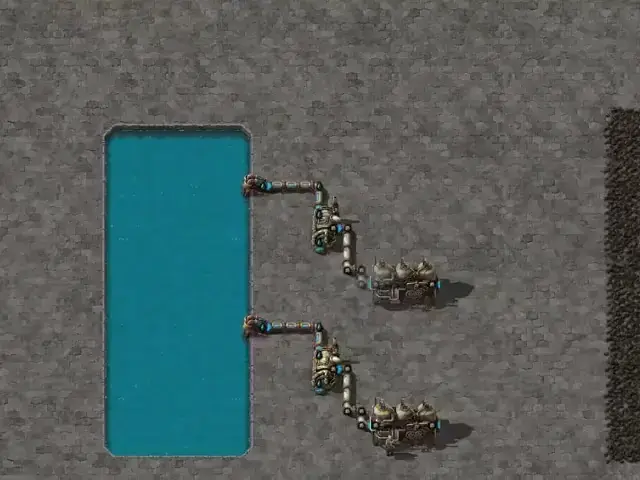

<h1 align="center">Factorio Learning Environment</h1>
<p align="center">
  <a href="https://jackhopkins.github.io/factorio-learning-environment/leaderboard">Leaderboard</a> | <a href="https://arxiv.org/abs/2503.09617">Paper</a> | <a href="https://jackhopkins.github.io/factorio-learning-environment/">Website</a> | <a href="https://jackhopkins.github.io/factorio-learning-environment/sphinx/build/html/">Documentation</a> | <a href="https://discord.gg/zKaV2skewa">Discord (#factorio-learning-env)</a>
</p>

<p align="center">
An open source framework for developing and evaluating LLM agents in the game of <a href="https://factorio.com/">Factorio</a>.
</p>

<p align="center">


</p>
<p align="center"><em>Claude Opus 4.1 Plays Factorio</em></p>

## Why FLE?

We provide two settings:

1. **Lab-play**: 24 structured tasks with fixed resources.
2. **Open-play**: An unbounded task of building the largest possible factory on a procedurally generated map.

Our results demonstrate that models still lack strong spatial reasoning. In lab-play, we find that while LLMs exhibit promising short-horizon skills, they are unable to operate effectively in constrained environments, reflecting limitations in error analysis. In open-play, while LLMs discover automation strategies that improve growth (e.g electric-powered drilling), they fail to achieve complex automation (e.g electronic-circuit manufacturing).

## Quick Start

### Installation

```bash
# Core FLE SDK package
pip install factorio-learning-environment
uv add factorio-learning-environment

# With optional features
pip install factorio-learning-environment[eval,mcp,psql]
```

### Basic Usage

```python
# Core SDK usage
from fle.env import FactorioInstance
instance = FactorioInstance()

# Gym environment usage
import gym
env = gym.make("iron_ore_throughput")
obs = env.reset()
```

### Command Line

```bash
# Start Factorio cluster
fle cluster start

# Run evaluation
fle eval --config configs/gym_run_config.json
```

## Documentation

- **[Complete Documentation](https://jackhopkins.github.io/factorio-learning-environment/sphinx/build/html/)** - Comprehensive guides, API reference, and examples
- **[Getting Started](https://jackhopkins.github.io/factorio-learning-environment/sphinx/build/html/getting_started/installation.html)** - Installation and setup
- **[API Reference](https://jackhopkins.github.io/factorio-learning-environment/sphinx/build/html/api/modules.html)** - Complete API documentation
- **[Examples](https://jackhopkins.github.io/factorio-learning-environment/sphinx/build/html/examples/basic_agent.html)** - Agent implementations and tutorials

## Contributing

We welcome contributions! Please see our [Contributing Guidelines](CONTRIBUTING.md) and [Complete Documentation](https://jackhopkins.github.io/factorio-learning-environment/sphinx/build/html/) for details.

## License

MIT License - see [LICENSE](LICENSE) for details.
